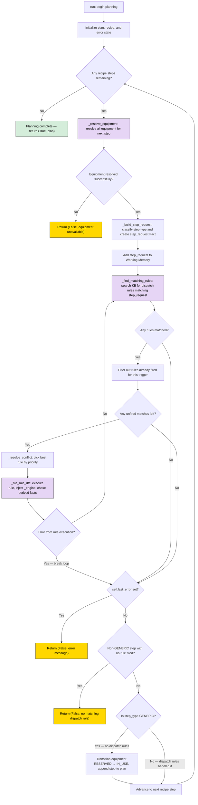
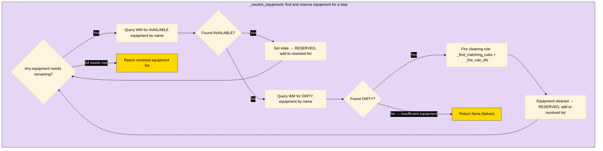
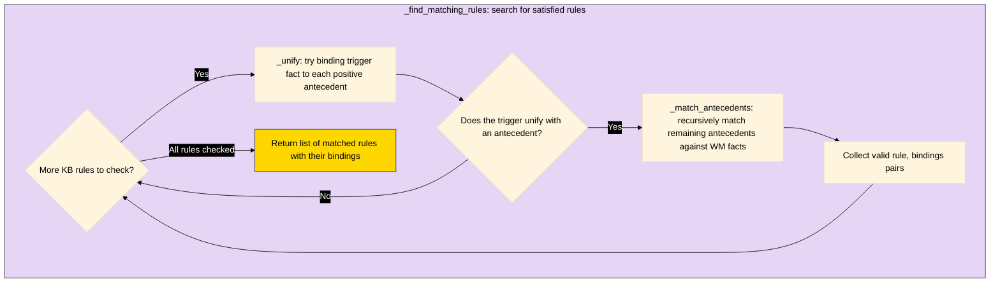
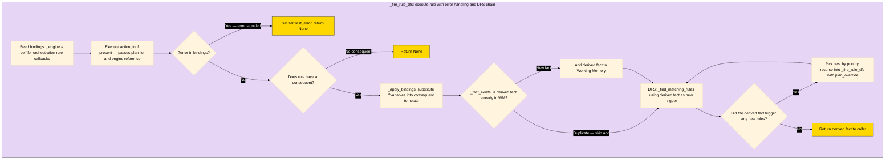

# Planning

The `PlanningEngine` is a forward-chaining production system that translates recipe steps into executable plans. It iterates over each recipe step, resolves required equipment, classifies the step type, and dispatches a `step_request` fact to specialized rules via forward chaining. Orchestration rules receive the engine instance via `bindings['_engine']`, enabling nested forward chaining and multi-level rule composition.

## 1. Your Code

All logic for planning is located in the `ROOT/planning` directory.

Rules and Facts are located in the `ROOT/planning/rules` and `ROOT/planning/facts` directories.

The `ROOT/planning/main.py` is the entrypoint and the `ROOT/planning/engine.py` contains all inference logic for the Rule Based Expert System.

### Classes

#### Shared Classes (between scaling and planning)

##### "Brain" Classes

- [KnowledgeBase](/classes/KnowledgeBase.py)
- [WorkingMemory](/classes/WorkingMemory.py)

##### Rule Based Expert System Classes

- [Fact](/classes/Fact.py)
- [Rule](/classes/Rule.py)
- [NegatedFact](/classes/NegatedFact.py)

##### Recipe / Cooking Domain Classes

- [Recipe](/classes/Recipe.py)
- [Ingredient](/classes/Ingredient.py)

##### [Explanation Facility](/classes/ExplanationFacility.py)

#### Planning Specific Classes

- [Step](/planning/classes/Step.py)
  - [CleaningStep](/planning/classes/CleaningStep.py)
  - [CookStep](/planning/classes/CookStep.py)
  - [MixingStep](/planning/classes/MixingStep.py)
    - [MixingSubstep](/planning/classes/MixingSubstep.py)
  - [PreheatStep](/planning/classes/PreheatStep.py)
  - [TransferStep](/planning/classes/TransferStep.py)
  - [TransferItem](/planning/classes/TransferItem.py)
  - [TransferEquipment](/planning/classes/TransferEquipment.py)
  
- [WaitStep](/planning/classes/WaitStep.py)

## How to Run

> [!WARNING]
> 
> You **must** include the `--run_planning_engine` flag to trigger the planning logic.

Call the main script in the ROOT of the directory with the following flags:

| Flag                    | Type    | Default   | Description                                       |
|-------------------------|---------|-----------|---------------------------------------------------|
| --run_planning_engine   | _n/a_   | False     | run the planning logic                            | 
| --scaling_factor        | int     | 2         | change scaling factor                             |             
| --num_ovens             | int     | 4         | change number of available ovens                  |
| --num_bowls             | int     | 1         | change number of available bowls                  |
| --num_baking_sheets     | int     | 5         | change number of available baking sheets          |
| --explain               | n/a     | False     | run the explanation REPL at the end of the script |

### Using UV

```
uv run python main.py --run_planning_engine --scaling_factor 200 --num_ovens 2 --num_bowls 4 --num_baking_sheets 4 --explain
```

### Pure Python

```
python3 main.py --run_planning_engine --scaling_factor 200 --num_ovens 2 --num_bowls 4 --num_baking_sheets 4  --explain
```

## Functions

| Method                                                       | Purpose                                                                                                                                                                                                |
|--------------------------------------------------------------|--------------------------------------------------------------------------------------------------------------------------------------------------------------------------------------------------------|
| `run(*, recipe)`                                             | Entry point — iterates recipe steps, resolves equipment, builds `step_request` facts, forward-chains dispatch rules, handles GENERIC fallback. Returns `(success, plan_or_error)`                      |
| `_resolve_equipment(*, equipment_need)`                      | Finds AVAILABLE equipment and reserves it; if none available, tries cleaning DIRTY equipment via rules. Returns resolved list or `None` on failure                                                     |
| `_build_step_request(*, step, step_idx, resolved_equipment)` | Boundary translation — converts a recipe Step object into a `step_request` Fact with step_type classification and attribute-based overrides                                                            |
| `_forward_chain(*, trigger_fact)`                            | Core loop — finds matching rules for a trigger, resolves conflicts by priority, fires via DFS; exhausts all matches with fired-set tracking. Returns `(any_rule_fired, last_derived_fact)`             |
| `_find_matching_rules(*, trigger_fact)`                      | Returns all `(rule, bindings)` pairs whose antecedents are satisfied, using `trigger_fact` as an anchor filter                                                                                         |
| `_match_antecedents(*, antecedents, bindings)`               | Recursively matches remaining antecedents against WM facts; handles `NegatedFact` via negation-as-failure                                                                                              |
| `_unify(*, pattern, fact, bindings)`                         | Pattern matching — unifies one antecedent pattern against one fact, binding `?variables`. Returns updated bindings or `None`                                                                           |
| `_apply_bindings(*, fact_template, bindings)`                | Substitutes `?variables` in a consequent template with concrete values from bindings                                                                                                                   |
| `_fact_exists(*, fact)`                                      | Duplicate check — returns `True` if an identical fact is already in working memory                                                                                                                     |
| `_resolve_conflict(*, matches)`                              | Picks the highest-priority rule from candidates (priority-only, no specificity option)                                                                                                                 |
| `_fire_rule_dfs(*, rule, bindings, plan_override=None)`      | Fires a rule (injects `_engine`, runs `action_fn` with plan, derives consequent), then DFS-chases triggered rules. Supports `plan_override` for per-oven substep lists. Propagates errors via `?error` |

## Flow Diagram

Purple boxes = functions detailed in Diagram 2 subgraphs.








