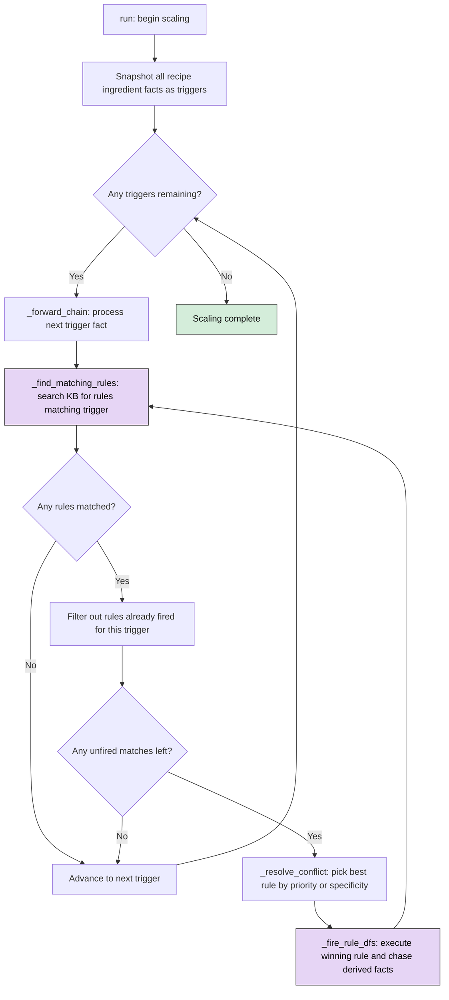

# Scaling Submission

The `ScalingEngine` is a forward-chaining production system that takes recipe ingredient facts and derives scaled/classified outputs by matching rules against working memory and knowledge base reference facts.

## 1. Your Code

All logic for scaling is located in the `ROOT/scaling` directory.

Rules and Facts are located in the `ROOT/scaling/rules` and `ROOT/scaling/facts` directories.

The `ROOT/scaling/main.py` is the entrypoint and the `ROOT/scaling/engine.py` contains all inference logic for the Rule Based Expert System.

### Classes

#### "Brain" Classes

- [KnowledgeBase](/classes/KnowledgeBase.py)
- [WorkingMemory](/classes/WorkingMemory.py)

#### Rule Based Expert System Classes

- [Fact](/classes/Fact.py)
- [Rule](/classes/Rule.py)
- [NegatedFact](/classes/NegatedFact.py)

#### Recipe / Cooking Domain Classes

- [Recipe](/classes/Recipe.py)
- [Ingredient](/classes/Ingredient.py)

#### [Explanation Facility](/classes/ExplanationFacility.py)

## How to Run

Call the main script in the ROOT of the directory with the following flags:

| Flag                          | Type                        | Default    | Description                                       |
|-------------------------------|-----------------------------|------------|---------------------------------------------------|
| --scaling_factor              | int                         | 2          | change scaling factor                             |   
| --scaling_conflict_resolution | "priority" or "specificity" | "priority" | change conflict resolution strategy               |
| --explain                     | n/a                         | False      | run the explanation REPL at the end of the script |

### Using UV

```
uv run python main.py --scaling_factor 200
```

### Pure Python

```
python3 main.py --scaling_factor 200
```

## Functions

| Method                                         | Purpose                                                                                                                                                                                           |
|------------------------------------------------|---------------------------------------------------------------------------------------------------------------------------------------------------------------------------------------------------|
| `run()`                                        | Entry point — snapshots `recipe_ingredient` facts as triggers, then forward-chains on each one                                                                                                    |
| `_forward_chain(*, trigger_fact)`              | Core loop — finds matching rules for a trigger, resolves conflicts, fires via DFS; exhausts all matches using a while-loop with fired-set tracking. Returns `(any_rule_fired, last_derived_fact)` |
| `_find_matching_rules(*, trigger_fact)`        | Returns all `(rule, bindings)` pairs whose antecedents are satisfied, using `trigger_fact` as an anchor filter                                                                                    |
| `_match_antecedents(*, antecedents, bindings)` | Recursively matches remaining antecedents against KB reference facts + WM facts; handles `NegatedFact` via negation-as-failure                                                                    |
| `_unify(*, pattern, fact, bindings)`           | Pattern matching — unifies one antecedent pattern against one fact, binding `?variables`. Returns updated bindings or `None` on failure                                                           |
| `_apply_bindings(*, fact_template, bindings)`  | Substitutes `?variables` in a consequent template with concrete values from bindings                                                                                                              |
| `_fact_exists(*, fact)`                        | Duplicate check — returns `True` if an identical fact is already in working memory                                                                                                                |
| `_resolve_conflict(*, matches)`                | Picks the best rule from candidates using priority (default) or specificity strategy                                                                                                              |
| `_fire_rule_dfs(*, rule, bindings)`            | Fires a rule (runs `action_fn`, derives consequent, adds to WM), then DFS-chases any rules triggered by the derived fact                                                                          |

## Flow Diagram

```mermaid
%%{init: {'theme': 'base', 'themeVariables': {'lineColor': '#000000', 'edgeLabelBackground': '#000000', 'primaryTextColor': '#ffffff'}}}%%
flowchart TD
    classDef default color:#000
    subgraph fire["_fire_rule_dfs: execute rule and DFS-chain"]
        FR1["Execute action_fn side-effect if rule defines one"] --> FR2{"Does rule have a consequent?"}
        FR2 -- "No consequent" --> FR10["Return None"]
        FR2 -- "Yes" --> FR3["_apply_bindings: substitute ?variables into consequent template"]
        FR3 --> FR4{"_fact_exists: is derived fact already in WM?"}
        FR4 -- "New fact" --> FR5["Add derived fact to Working Memory"]
        FR4 -- "Duplicate — skip add" --> FR6["DFS: _find_matching_rules using derived fact as new trigger"]
        FR5 --> FR6
        FR6 --> FR7{"Did the derived fact trigger any new rules?"}
        FR7 -- Yes --> FR8["_resolve_conflict: pick best, then recurse into _fire_rule_dfs"]
        FR8 --> FR6
        FR7 -- No --> FR9["Return derived fact to caller"]
    end

    subgraph find["_find_matching_rules: search for satisfied rules"]
        FM1{"More KB rules to check?"} -- Yes --> FM2["_unify: try to bind trigger fact to each rule antecedent"]
        FM2 --> FM3{"Does the trigger unify with an antecedent?"}
        FM3 -- No --> FM1
        FM3 -- Yes --> FM4["_match_antecedents: recursively match remaining antecedents against KB + WM facts"]
        FM4 --> FM5["Collect valid rule, bindings pairs"]
        FM5 --> FM1
        FM1 -- "All rules checked" --> FM6["Return list of matched rules with their bindings"]
    end

    style fire fill:#e6d5f5,stroke:#333,color:#000
    style find fill:#e6d5f5,stroke:#333,color:#000
    style FR9 fill:#ffd700,stroke:#333,color:#000
    style FR10 fill:#ffd700,stroke:#333,color:#000
    style FM6 fill:#ffd700,stroke:#333,color:#000
```




