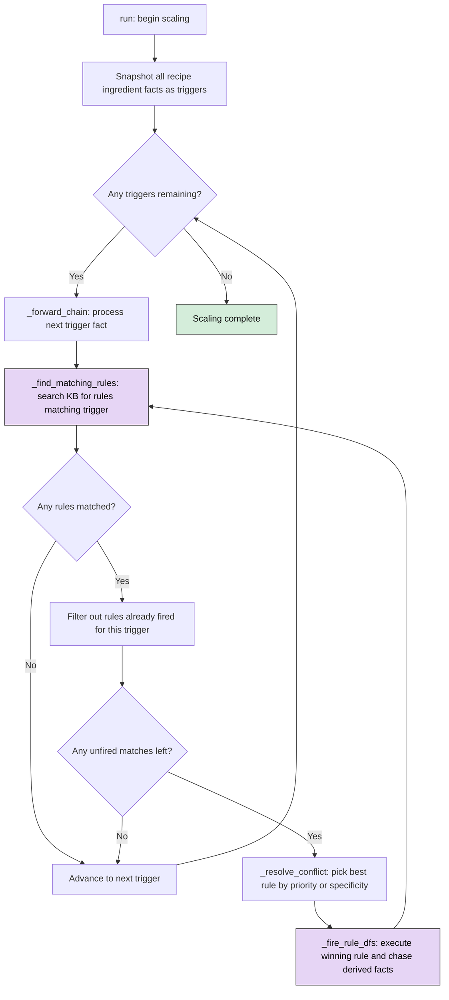
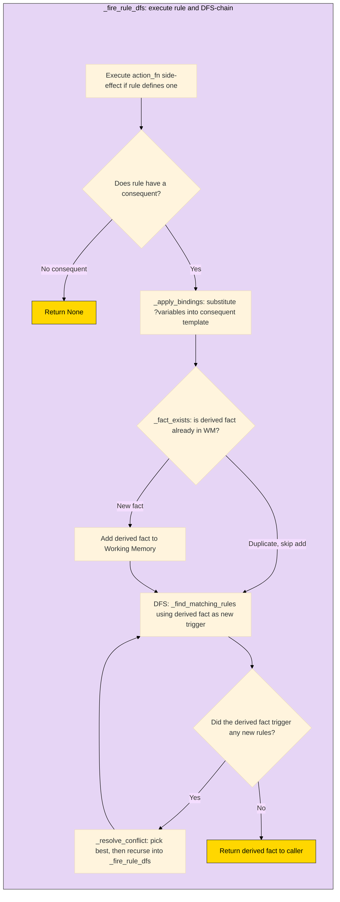
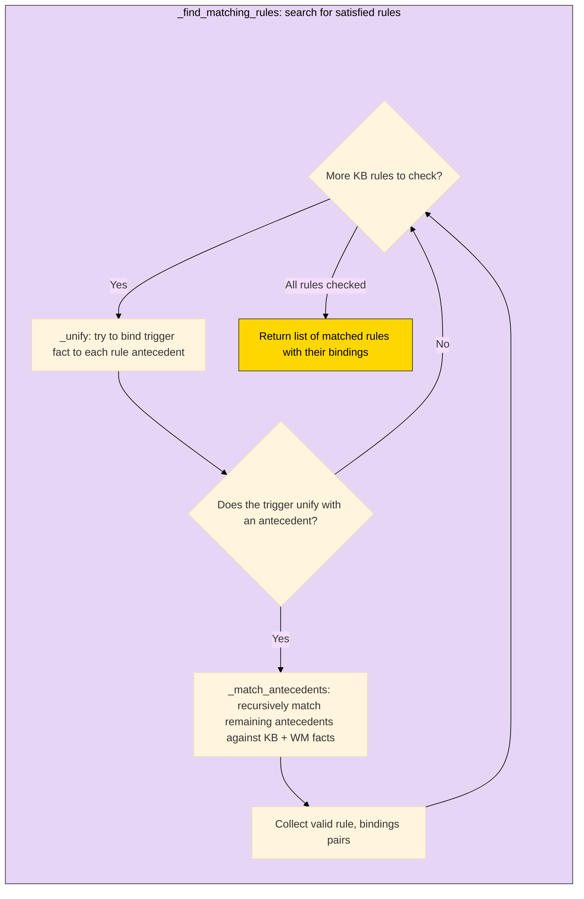

# Scaling Submission

The `ScalingEngine` is a forward-chaining system that takes recipe ingredient facts and derives scaled/classified outputs by matching rules against working memory and knowledge base reference facts.

## System Overview

The shared infrastructure classes (`Fact`, `Rule`, `NegatedFact`, `KnowledgeBase`, `WorkingMemory`) provide the core rule-based expert system machinery. The scaling engine drives a strictly linear derivation chain:

**`recipe_ingredient` -> `classified_ingredient` -> `ingredient_scaling_multiplier` -> `scaled_ingredient` -> `optimally_scaled_ingredient`**

Each stage is handled by rules. A single ingredient fact enters the chain and cascades through all stages via depth-first recursive chaining before the next ingredient is processed.

The `ExplanationFacility` records every rule firing and fact derivation, enabling post-hoc "why?" queries on any derived fact.

## 1. Your Code

All logic for scaling is located in the `ROOT/scaling` directory.

Rules and Facts are located in the `ROOT/scaling/rules` and `ROOT/scaling/facts` directories.

The `ROOT/scaling/main.py` is the entrypoint and the `ROOT/scaling/engine.py` contains all inference logic for the Rule Based Expert System.

### Classes

#### "Brain" Classes

- [KnowledgeBase](/classes/KnowledgeBase.py)
- [WorkingMemory](/classes/WorkingMemory.py)

#### Rule Based Expert System Classes

- [Fact](/classes/Fact.py)
- [Rule](/classes/Rule.py)
- [NegatedFact](/classes/NegatedFact.py)

#### Recipe / Cooking Domain Classes

- [Recipe](/classes/Recipe.py)
- [Ingredient](/classes/Ingredient.py)

#### [Explanation Facility](/classes/ExplanationFacility.py)

## How to Run

Call the `main.py` script in the ROOT of the directory with the following flags:

| Flag                          | Type                        | Default    | Description                                       |
|-------------------------------|-----------------------------|------------|---------------------------------------------------|
| --scaling_factor              | float                       | 2          | change scaling factor                             |   
| --scaling_conflict_resolution | "priority" or "specificity" | "priority" | change conflict resolution strategy               |
| --explain                     | n/a                         | False      | run the explanation REPL at the end of the script |

### Using UV

```
uv run python main.py --scaling_factor 200
```

### Pure Python

```
python main.py --scaling_factor 200
```

## Design Decisions

- **Forward-chaining**: Ingredients are the known data and rules derive conclusions from them. This is a natural fit since we start with concrete recipe facts and chain forward to scaled outputs, rather than starting from a goal and working backward.

- **DFS rule firing**: When a rule derives a new fact, the engine immediately chases that fact as a trigger before returning to the original trigger list. This means a single ingredient fact cascades through classification, multiplier computation, scaling, and unit conversion in one recursive pass.

- **Keyword-only constructors on Fact/Rule**: All attributes are passed as named parameters. This prevents positional argument bugs when facts have many similarly-typed string/float attributes (ingredient_name, amount, unit, and classification all look alike positionally).

- **action_fn hybrid**: Rules handle pattern matching and sequencing. Action functions handle the actual math (computing scaled amounts, breaking into optimal units). This keeps rules declarative while allowing imperative computation where needed.

- **NegatedFact guards**: `classify_known_ingredient` uses `NegatedFact(fact_title='classified_ingredient', ...)` to prevent re-classifying an already-classified ingredient. This ensures each ingredient is processed exactly once through the classification stage.

- **Priority-based conflict resolution (default)**: Assign explicit priority values to rules to control which rule wins when multiple rules match. This is the default strategy, though specificity-based resolution is also supported via the `--scaling_conflict_resolution` flag.

## Flow Diagram

Purple boxes = functions detailed in Diagram 2 subgraphs.







## Conflict Resolution Strategies

The scaling engine supports two conflict resolution strategies (`--scaling_conflict_resolution`): **priority** (default) and **specificity** but both converge to the same outcome in this system.

### The Linear Rule Chain

The scaling rule chain is strictly linear. At each inference step, only one *category* of rule is relevant:

1. **Classify** the ingredient (classify_known or classify_default)
2. **Compute** the scaling multiplier
3. **Scale** the ingredient
4. **Optimize** the measurement units

Between stages, there is exactly one candidate rule category that matches the most recently derived fact. The only point where multiple rules compete is *within* a stage, specifically at classification: `classify_known_ingredient` vs. `classify_default_ingredient`.

### Priority

Explicit priority values control firing order. `classify_known_ingredient` (priority 100) beats `classify_default_ingredient` (priority 50) when both match. Between stages, only one rule category matches, so priority has no further effect.

### Specificity

The rule with more antecedents wins. `classify_known_ingredient` has 3 antecedents (recipe_ingredient + KB classification fact + NegatedFact guard), while `classify_default_ingredient` also has 3 antecedents (recipe_ingredient + 2 NegatedFact guards). Since both rules have the same antecedent count, specificity cannot break the tie and priority still decides. Between stages, only one rule category matches, so specificity cannot change the order.

### Recency (not directly implemented as unique strategy)

The most recently derived fact triggers the next stage. Since DFS immediately chains derived facts, the engine always processes the newest fact first. This produces the same firing order as priority: the chain progresses linearly from classification through optimization, and within classification, the known-ingredient rule fires first because it matches the same trigger as the default rule (and priority breaks the tie before recency is consulted).
