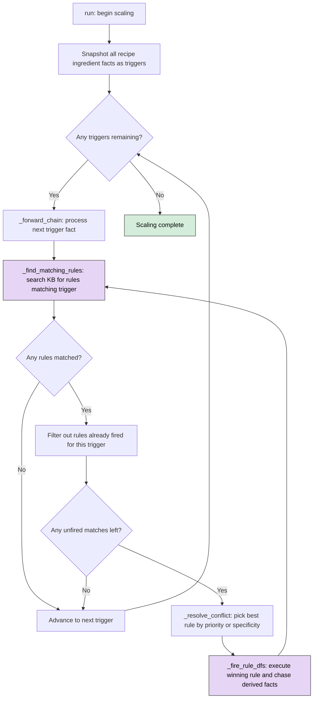
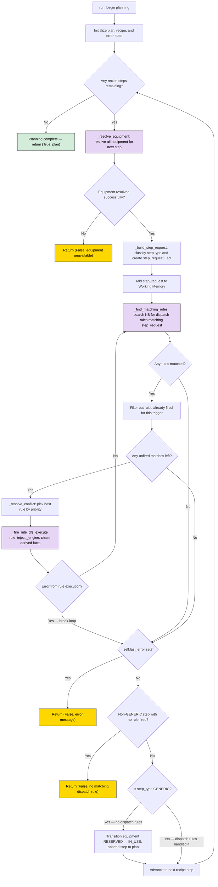
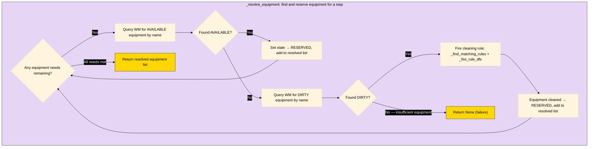
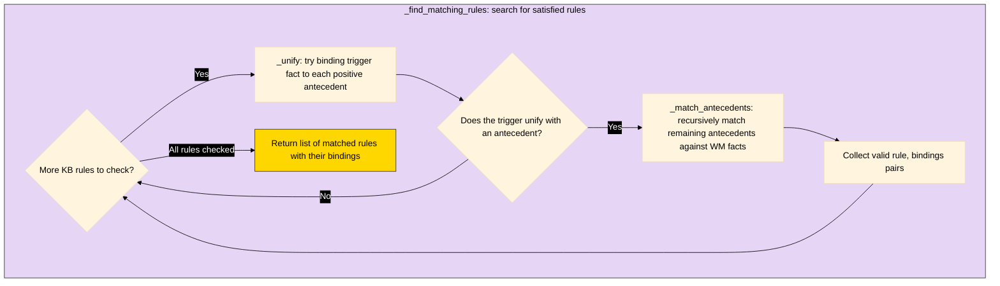
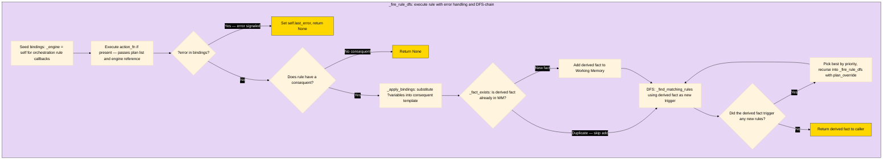

# Rule Based Depth First Expert System for Recipe Scaling

## Brain

### Knowledge Base

> The Knowledge Base holds permanent knowledge: Rules & Reference Facts
> 
> A Reference Fact is "background" knowledge (unit conversions, classification, etc. relevant to the domain)

### Working Memory

> Working Memory is the "current state" of the application holding the current facts that have been derived based on the matching and unification of the Knowledge Base Rules with the Working Memory facts.

## Inference Engines

### Scaling

The `ScalingEngine` is a forward-chaining production system that takes recipe ingredient facts and derives scaled/classified outputs by matching rules against working memory and knowledge base reference facts.

#### Functions

| Method | Purpose |
|---|---|
| `run()` | Entry point — snapshots `recipe_ingredient` facts as triggers, then forward-chains on each one |
| `_forward_chain(*, trigger_fact)` | Core loop — finds matching rules for a trigger, resolves conflicts, fires via DFS; exhausts all matches using a while-loop with fired-set tracking. Returns `(any_rule_fired, last_derived_fact)` |
| `_find_matching_rules(*, trigger_fact)` | Returns all `(rule, bindings)` pairs whose antecedents are satisfied, using `trigger_fact` as an anchor filter |
| `_match_antecedents(*, antecedents, bindings)` | Recursively matches remaining antecedents against KB reference facts + WM facts; handles `NegatedFact` via negation-as-failure |
| `_unify(*, pattern, fact, bindings)` | Pattern matching — unifies one antecedent pattern against one fact, binding `?variables`. Returns updated bindings or `None` on failure |
| `_apply_bindings(*, fact_template, bindings)` | Substitutes `?variables` in a consequent template with concrete values from bindings |
| `_fact_exists(*, fact)` | Duplicate check — returns `True` if an identical fact is already in working memory |
| `_resolve_conflict(*, matches)` | Picks the best rule from candidates using priority (default) or specificity strategy |
| `_fire_rule_dfs(*, rule, bindings)` | Fires a rule (runs `action_fn`, derives consequent, adds to WM), then DFS-chases any rules triggered by the derived fact |

#### Flow Diagram





```mermaid
%%{init: {'theme': 'base', 'themeVariables': {'lineColor': '#000000', 'edgeLabelBackground': '#000000', 'primaryTextColor': '#ffffff'}}}%%
flowchart TD
    classDef default color:#000
    subgraph fire["_fire_rule_dfs: execute rule and DFS-chain"]
        FR1["Execute action_fn side-effect if rule defines one"] --> FR2{"Does rule have a consequent?"}
        FR2 -- "No consequent" --> FR10["Return None"]
        FR2 -- "Yes" --> FR3["_apply_bindings: substitute ?variables into consequent template"]
        FR3 --> FR4{"_fact_exists: is derived fact already in WM?"}
        FR4 -- "New fact" --> FR5["Add derived fact to Working Memory"]
        FR4 -- "Duplicate — skip add" --> FR6["DFS: _find_matching_rules using derived fact as new trigger"]
        FR5 --> FR6
        FR6 --> FR7{"Did the derived fact trigger any new rules?"}
        FR7 -- Yes --> FR8["_resolve_conflict: pick best, then recurse into _fire_rule_dfs"]
        FR8 --> FR6
        FR7 -- No --> FR9["Return derived fact to caller"]
    end

    subgraph find["_find_matching_rules: search for satisfied rules"]
        FM1{"More KB rules to check?"} -- Yes --> FM2["_unify: try to bind trigger fact to each rule antecedent"]
        FM2 --> FM3{"Does the trigger unify with an antecedent?"}
        FM3 -- No --> FM1
        FM3 -- Yes --> FM4["_match_antecedents: recursively match remaining antecedents against KB + WM facts"]
        FM4 --> FM5["Collect valid rule, bindings pairs"]
        FM5 --> FM1
        FM1 -- "All rules checked" --> FM6["Return list of matched rules with their bindings"]
    end

    style fire fill:#e6d5f5,stroke:#333,color:#000
    style find fill:#e6d5f5,stroke:#333,color:#000
    style FR9 fill:#ffd700,stroke:#333,color:#000
    style FR10 fill:#ffd700,stroke:#333,color:#000
    style FM6 fill:#ffd700,stroke:#333,color:#000
```

### Planning

The `PlanningEngine` is a forward-chaining production system that translates recipe steps into executable plans. It iterates over each recipe step, resolves required equipment, classifies the step type, and dispatches a `step_request` fact to specialized rules via forward chaining. Orchestration rules receive the engine instance via `bindings['_engine']`, enabling nested forward chaining and multi-level rule composition.

#### Functions

| Method | Purpose |
|---|---|
| `run(*, recipe)` | Entry point — iterates recipe steps, resolves equipment, builds `step_request` facts, forward-chains dispatch rules, handles GENERIC fallback. Returns `(success, plan_or_error)` |
| `_resolve_equipment(*, equipment_need)` | Finds AVAILABLE equipment and reserves it; if none available, tries cleaning DIRTY equipment via rules. Returns resolved list or `None` on failure |
| `_build_step_request(*, step, step_idx, resolved_equipment)` | Boundary translation — converts a recipe Step object into a `step_request` Fact with step_type classification and attribute-based overrides |
| `_forward_chain(*, trigger_fact)` | Core loop — finds matching rules for a trigger, resolves conflicts by priority, fires via DFS; exhausts all matches with fired-set tracking. Returns `(any_rule_fired, last_derived_fact)` |
| `_find_matching_rules(*, trigger_fact)` | Returns all `(rule, bindings)` pairs whose antecedents are satisfied, using `trigger_fact` as an anchor filter |
| `_match_antecedents(*, antecedents, bindings)` | Recursively matches remaining antecedents against WM facts; handles `NegatedFact` via negation-as-failure |
| `_unify(*, pattern, fact, bindings)` | Pattern matching — unifies one antecedent pattern against one fact, binding `?variables`. Returns updated bindings or `None` |
| `_apply_bindings(*, fact_template, bindings)` | Substitutes `?variables` in a consequent template with concrete values from bindings |
| `_fact_exists(*, fact)` | Duplicate check — returns `True` if an identical fact is already in working memory |
| `_resolve_conflict(*, matches)` | Picks the highest-priority rule from candidates (priority-only, no specificity option) |
| `_fire_rule_dfs(*, rule, bindings, plan_override=None)` | Fires a rule (injects `_engine`, runs `action_fn` with plan, derives consequent), then DFS-chases triggered rules. Supports `plan_override` for per-oven substep lists. Propagates errors via `?error` |

#### Flow Diagram

Purple boxes = functions detailed in Diagram 2 subgraphs.








## Running Tests

```bash
make test
```
